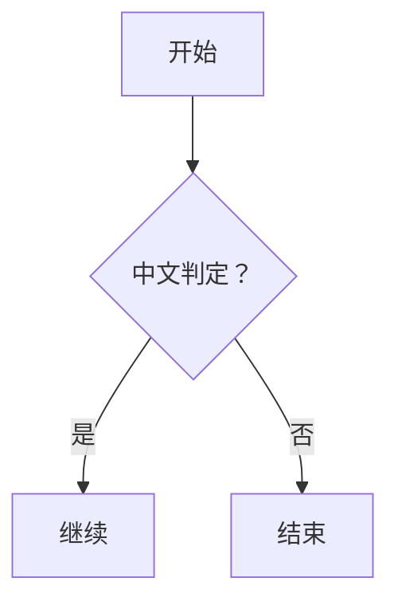

# 合成边缘样本：Mermaid、脚注、实体、混合列表

本文件不在仓库语料中，为覆盖 T02 要求的 Mermaid 与脚注类别而合成。

脚注引用[^1]与行内实体 &lt;tag&gt;、&amp;、&quot;quotes&quot;。

- 星号列表项一
* 星号列表项二
+ 加号列表项三
1. 有序项一
2. 有序项二
   - 嵌套无序
     1. 嵌套有序

| 左对齐 | 居中 | 右对齐 |
|:-------|:----:|-------:|
| a      |  b   |      c |

- [ ] 未完成任务
- [x] 已完成任务

[^1]: 这是脚注正文，含**粗体**与`代码`。
